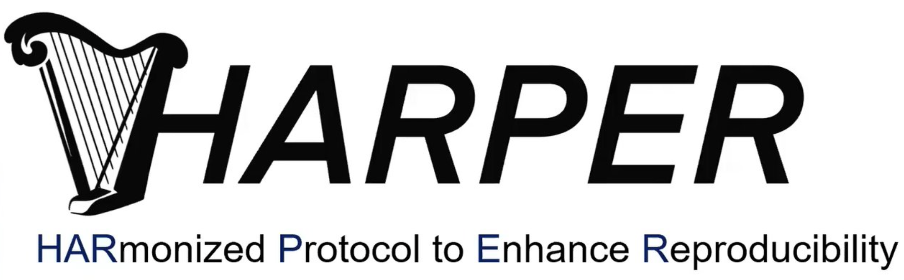

# HARPER

This is a GitLab/quarto-based template for the HARmonized Protocol Template to Enhance Reproducibility (HARPER) of Hypothesis Evaluating Real-World Evidence Studies on Treatment Effects: A Good Practices Report of a Joint ISPE/ISPOR Task Force (HARPER) protocol

## About

**Welcome to the quarto HARPER template!**

You can fork and use this template to quick-start your projects.

## How to use this template

This template is useful for real-world evidence (RWE) studies performed using the R or Python programming language. By forking the template, users can kickstart their analysis by having a Quarto-based HARPER document template (and corresponding table shells) along with pre-configured `.yml` files for continuous deployment of a project-specfic website using GitLab.

Step 1: Fork the repository and enter your project details (e.g. repository name, etc.)

Step 2: Remove the fork relationship under `Settings > General > Advanced >  Remove fork relationship`

Step 3: Execute `renv::restore()` to install all required dependencies (R packages) in the project-specific renv R package library.

Step 4: Enter/specify you project details in:

* README.md

* _quarto.yml

* .gitlab-ci.yml ([adjust the CI to your system if needed](https://docs.gitlab.com/ee/user/project/pages/getting_started/pages_forked_sample_project.html))

Step 5: Customize as much as needed and conduct great research!

## Repository details

This template is conceptualized for a typical RWE study with the following sub-directories/-files:

* `README.md`: Short description and information about the project. Could include background, aims/objectives, IRB/privacy information and details on repdroducibility

* `index.qmd`: Landing page of quarto website. Could include similar information as `README.md`

* `protocol`: HARPER quarto template (`protocol,qmd`) with empty table shells included in the protocol, template for study design figures and HARPER pdf template. It also contains a pre-configured `references.bib` BibTex file for citations/references one may want to include in the protocol.

* `documentation`: Sub-directory for documentation materials, e.g. data dictionaries or IRB approval letters.

* `scripts`: Sub-directory for R/Python analysis scripts. It is recommended to have a clear labeling such as: *1_data_query.qmd*, *2_descriptives.qmd*, *3_main_analysis*, *4_senstivity_analysis*, etc.

* `functions`: Custom R/Python functions to be sourced in analysis scripts.

* `results`: Sub-directory for collecting publication-ready tables, figures and other material relevant to communicate results.

* `public`: output directory for all quarto scripts and resources published on the website. This is particularly useful to publish annotated and interactive outputs along with a peer-reviewed manuscript as a measure of enhanced transpareny and reproducibility and a way to augment and support study results. The name of the output directory can be customized in the `_quarto.yml` file according to specific system needs (for more details see the [quarto webiste](https://quarto.org/docs/projects/quarto-projects.html)).

* `manuscript`: Sub-directory where manuscript and supplementary material can be drafted and stored.

* `renv`: Project-specific R package library. Fore more information, please visit the [renv website](https://rstudio.github.io/renv/articles/renv.html).

* `.gitignore`: File to specify which files should not be tracked via git.

* `.Rprofile`: Environment file for R projects to store things like paths or keys (you can also setup an `.Renviron`)

* `_quarto.yml` and `.gitlab-ci.yml`: Global settings for Quarto and Gitlab CI/CD

Of course you can customize and remove/add other files and directories. For example, one may also want to add bash files to orchestrate the execution of different scripts.

# References

Wang SV, Pottegård A, Crown W, Arlett P, Ashcroft DM, Benchimol EI, Berger ML, Crane G, Goettsch W, Hua W, Kabadi S, Kern DM, Kurz X, Langan S, Nonaka T, Orsini L, Perez-Gutthann S, Pinheiro S, Pratt N, Schneeweiss S, Toussi M, Williams RJ. HARmonized Protocol Template to Enhance Reproducibility of hypothesis evaluating real-world evidence studies on treatment effects: A good practices report of a joint ISPE/ISPOR task force. Pharmacoepidemiol Drug Saf. 2023 Jan;32(1):44-55. doi: 10.1002/pds.5507. Epub 2022 Oct 10. PMID: 36215113; PMCID: PMC9771861.

For more information, please visit:
<https://osf.io/6qxpf/>

# Version

`HARPER-based quarato template for GitLab version 0.0.1`